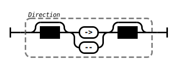

This page illustrates the grammar of **PG format** as railroad diagram. The diagrams have been [generated automatically](https://github.com/peggyjs/peggy-tracks) from the [reference grammar](../src/pg.pegjs) so they are guaranteed to match the implementation.

*Some details of PG formats are [still being discussed](https://github.com/g2glab/pg-formatter/discussions) so this may change!*

A property graph (**PG**) is encoded in PG format in Unicode as a sequence of
**lines**, separated by line breaks and/or semicolons (`U+003B`): 

Any sequence of consecutive carriage return (`U+000D`) and/or line feed
(`U+000A`) is a **line break** and any sequence of space (`U+0020`) and/or
tabular (`U+0009`) is a **space**:

A line either contains an **entity** or it is **empty**. A **trailing space**,
including an optional **comment**, is ignored after an entity and in an empty
line:

A comment starts with a hash (`U+0023`) and it ends at the next line break or at the end of input.

---

An entity is either a **node** with its node identifier or an **edge** with two
node identifiers connected via a direction. Both nodes and edges can be
followed by optional labels and properties.

All elements of an entity must be separated by **Whitespace**. This can either
be a space or a line break, if the next line starts with a space. A trailing
space, comments and empty lines are ignored in between: 

---

The **direction** of an edge must be separated from its node identifiers with whitespace:

A **label** is an identifier preceded by whitespace and a colon:

A **property** is preceded by whitespace and it consists of a key and a non-empty list of comma-separated values:

*FIXME: the ValueList diagram is misleading*

---

An **identifier** is either given as quoted string or in plain form. A plain
identifier must not contain spaces, tabs, or quotation marks and it must not
start with colon, comma, opening parenthesis or hash:

A property **key** is an identifier that ends with a colon:

---

An individual **value** can be given strictly following JSON grammar (RFC 7159)
or as unquoted string. The latter is like a plain identifier but in addition it
must not contain a colon nor comma:

---

Known caveats and edge cases:

- Both semicolon and hash are allowed in elements, so they must be preceded by
  space, if immediately following them

